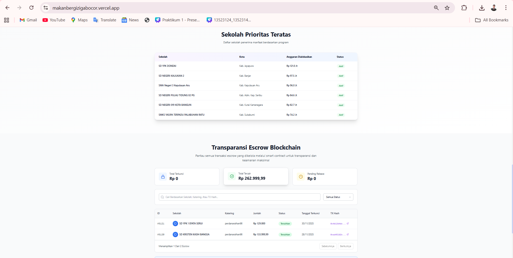

# UAS-3 My Innovations

**MakanBergiziGabocor: Rekayasa Sistem Sosio-Teknis untuk Prioritisasi dan Transparansi Program Pangan**

{width="100%"}
https://makanbergizigabocor.vercel.app/

Inovasi yang saya ajukan dalam masterpiece ini berangkat dari satu pertanyaan mendasar: *bagaimana merancang sistem teknologi informasi yang tidak hanya membantu pemerintah bekerja lebih efisien, tetapi juga membantu masyarakat mempercayai bahwa kebijakan pangan dijalankan secara adil dan tepat sasaran?* Jawaban atas pertanyaan ini saya wujudkan melalui sebuah artefak sistem sosio-teknis berupa aplikasi web **MakanBergiziGabocor** yang saya buat bersama tim lomba hackathon saya pada November 2025.

Aplikasi ini bukan sekadar platform digital, melainkan sebuah **lingkungan kerja sistemik** yang mengintegrasikan Artificial Intelligence dan blockchain untuk menjawab dua masalah inti dalam program pangan: **penentuan prioritas wilayah** dan **transparansi penyaluran dana serta makanan**.

## I. Arsitektur Inovasi: Dari Data ke Keputusan Publik
Lapisan pertama dari inovasi ini adalah sistem backend yang dirancang untuk mengelola dan mengintegrasikan berbagai sumber data relevan, seperti indikator sosial, kondisi wilayah, dan distribusi penerima manfaat. Di atas lapisan ini, Artificial Intelligence digunakan sebagai **mesin analisis prioritas**, bukan sebagai pengambil keputusan otonom.

Peran AI dalam sistem ini adalah:

1.  mengidentifikasi pola kerawanan pangan yang tersembunyi dalam data,

2.  memberikan rekomendasi wilayah prioritas secara objektif,

3.  dan memperbarui analisis secara adaptif seiring masuknya data baru.

Dengan pendekatan ini, AI berfungsi sebagai **decision-support engine** yang membantu pembuat kebijakan melihat realitas secara lebih utuh, tanpa menghilangkan ruang pertimbangan manusia.

## II. Blockchain sebagai Infrastruktur Kepercayaan

Lapisan kedua dari inovasi ini adalah penggunaan teknologi blockchain untuk membangun **rantai kepercayaan** dalam distribusi program makan bergizi. Dalam praktiknya, salah satu kelemahan utama program sosial adalah sulitnya menelusuri aliran dana dan barang secara transparan dari hulu ke hilir.

Melalui blockchain, setiap tahap penyaluran—mulai dari alokasi dana pemerintah, pembayaran kepada penyedia katering, hingga distribusi makanan ke sekolah—dicatat secara immutable dan dapat diaudit. Pendekatan ini mengubah transparansi dari sekadar klaim administratif menjadi **properti sistemik**.

Dengan demikian, blockchain tidak diposisikan sebagai tren teknologi, melainkan sebagai **mekanisme rekayasa akuntabilitas** yang mengurangi ruang ambiguitas dan meningkatkan kepercayaan antar pemangku kepentingan.

## III. Web Platform sebagai Ruang Interaksi Pemangku Kepentingan

Lapisan ketiga adalah antarmuka web yang berfungsi sebagai **ruang interaksi antara pemerintah**, penyedia layanan, dan masyarakat. Platform ini dirancang agar:

1.  pemerintah dapat memantau efektivitas kebijakan,

2.  penyedia layanan memahami kewajiban dan hak mereka secara jelas,

3.  masyarakat dapat melihat proses penyaluran secara transparan.

Dalam konteks ini, web platform tidak hanya berfungsi sebagai alat visualisasi, tetapi sebagai **medium komunikasi publik** yang menjembatani sistem teknis dan realitas sosial.

## IV. Inovasi sebagai Rekayasa Sistem, Bukan Sekadar Produk

Yang membedakan MakanBergiziGabocor dari aplikasi pada umumnya adalah orientasinya sebagai **rekayasa sistem sosio-teknis**, bukan sekadar produk digital. Inovasi ini tidak bertumpu pada satu teknologi tunggal, melainkan pada orkestrasi:

1.  backend system yang andal,

2.  AI yang bersifat asistif,

3.  dan blockchain yang menjamin keterlacakan.

Keseluruhan sistem ini dirancang untuk mendukung satu tujuan utama: **membantu manusia membuat keputusan publik yang lebih adil, transparan, dan berbasis bukti** dalam menghadapi masalah kelaparan dan kerawanan pangan.

Dengan demikian, inovasi yang saya ajukan bukanlah solusi instan, melainkan **fondasi sistemik** yang dapat terus dikembangkan, dievaluasi, dan diadaptasi seiring kompleksitas masalah sosial yang dihadapi.